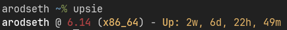

# Upsie

A utility written in Zig that takes the best of `uptime` and `uname -a` and displays it in a beautiful way.

`upsie` displays:
* The current hostname.
* The current Linux kernel version (use `-l` to display the full Linux kernel version).
* The current architecture (like `x86_64`).
* The current uptime, neatly formatted.

### General info

* License: BSD-3
* Version: 0.0.1
